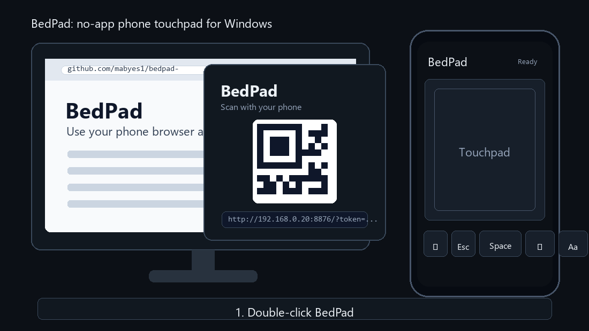

# BedPad

[English](README.md)

把手機瀏覽器變成 Windows 電腦的迷你觸控板。

不用裝手機 App。不用帳號。一個 Python 檔就能跑。特別適合躺在床上、沙發上遠端控制電腦。



## 功能

- 單指拖曳移動電腦游標。
- 短按等於左鍵。
- 長按等於右鍵。
- 雙擊打開手機打字面板。
- 雙指滑動滾頁。
- 快捷鍵：Backspace、Esc、Space、Enter。
- 文字輸入會送到 Windows 目前聚焦的 App。
- 預設使用隨機網址 token。
- Launcher 啟動時會先清掉舊的 BedPad server，再建立新的 QR code。

## 定位

這類工具不是全新發明。KDE Connect、Unified Remote、Remote Mouse、Unrud Remote Touchpad 都做過相近事情。

BedPad 的目標比較小：做一個透明、輕量、好改、能馬上用的 Windows 手機觸控板。

## 需求

- Windows
- Python 3.10 或更新版本
- 手機和電腦在同一個可信任區域網路

## 快速開始

在 Windows 上雙擊：

```text
run-bedpad.cmd
```

BedPad 會打開一個小視窗並顯示 QR code。用手機掃描後就能使用。

第一次啟動可能會詢問是否安裝 `qrcode[pil]`，這是用來產生 QR code 的小套件。

如果你再次雙擊 launcher，它會先停止上一個 BedPad server，再產生新的 QR code。

## 命令列

```powershell
python .\bedpad.py
```

接著用手機打開終端機印出的網址。

## 手勢

| 手機操作 | 電腦動作 |
| --- | --- |
| 單指拖曳 | 移動游標 |
| 短按 | 左鍵 |
| 長按 | 右鍵 |
| 雙擊 | 打開打字面板 |
| 雙指滑動 | 滾頁 |
| 打字面板送出 | 對目前聚焦的 App 輸入文字 |

## 選項

```powershell
python .\bedpad.py --port 8876
python .\bedpad.py --host 127.0.0.1
python .\bedpad.py --token your-local-token
```

## 安全提醒

BedPad 會對目前的 Windows 工作階段注入滑鼠和鍵盤事件。請把 QR code 和網址當成臨時遙控器鑰匙。

- 只在可信任的家用或私人區域網路使用。
- 不要公開完整網址或 token。
- 用完就關掉 BedPad。
- 不要把連接埠暴露到網際網路。

## 疑難排解

### 手機顯示 `Forbidden`

通常是掃到舊 QR code，或打開了舊網址。關掉 BedPad，重新雙擊 `run-bedpad.cmd`，再掃新的 QR code。

### 手機打不開頁面

- 確認手機和電腦在同一個 Wi-Fi 或區域網路。
- 檢查 Windows Firewall 是否允許 Python 在私人網路通訊。
- 也可以從 launcher 複製網址傳到手機上打開。

## 路線圖

- Windows tray app。
- 打包成 `.exe`。
- 游標和滾動靈敏度設定。
- 媒體鍵與簡報模式。
- 可選的區網 HTTPS。

## 授權

MIT
